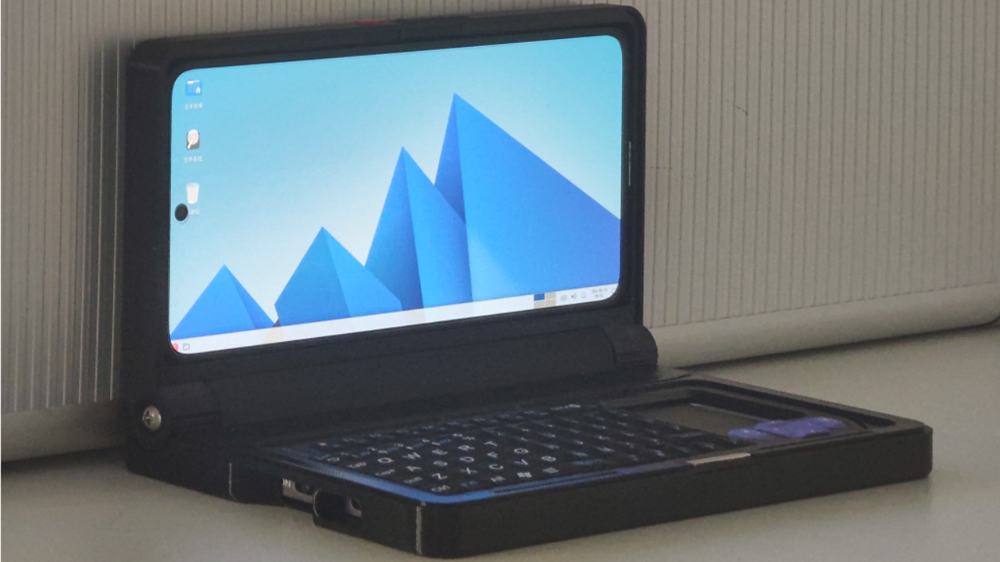

[English](README.md)

# Tiny Container

> [!NOTE]
> Linux 很强大。Linux 也可以易于使用。

### 安装小小容器（Tiny Container），立刻获得一个 Linux 电脑*，在你的手机/平板上使用 PC 软件！

## 特点

### 为普通用户设计。你不需要懂 Linux......

1. 安装软件并打开，你不需要进行任何操作*，5分钟的初始化后立刻进入电脑界面。
2. 常用软件的安装命令已为你准备好。点击，然后软件为你完成剩下的工作。
3. 软件的界面尽可能友好地设计了，而不是"有个界面就行"。让AI加上了许多语言的翻译。甚至支持rtl布局！
    - （虽然，因为我并不使用rtl，也看不懂AI的翻译，不知道准不准确！但是有总比没有好吧？）

### 同时也是给极客的玩具，内置终端、拥有丰富的容器配置选项！

4. 容器和配置可以随意分享！
5. 取自Termux社区的前沿功能已准备就绪！你不需要学习如何安装容器、启动图形界面、配置音频等等繁琐工作。以下功能是即开即用的：
    - 安装容器通过导入按钮，图形界面的启动已包含在内（如果容器支持）；
    - 软件内置AVNC和Termux:X11前端，你不需要额外安装软件；
    - 音频和麦克风转发；
    - virglrenderer和turnip+zink图形加速...
6. 单软件才方便做到的功能！
    - 音频和VNC通过unix socket传输，不经过网络栈；
    - 通过saf文件管理器浏览容器文件；
    - 可以将.desktop文件，甚至一般命令作为快捷方式放置到安卓启动器！
7. 不会和Termux冲突！

这个项目的目标是让普通用户尽可能轻松地享受 Linux 的乐趣。  
众所周知，Termux 对开发者来说简直就是一座宝库，它极大地提升了设备的可玩性。  
而开发者之外，鲜有人能意识到自己的设备有如此潜能，所以我希望此项目能降低门槛。  

> [!CAUTION]  
> 这个项目大量使用AI。考虑到这个完成度，不使用是不可能的吧...？对吧？  
> 包括代码逻辑，布局，翻译等等。可能有些地方有意想不到的bug。请注意。

我不会做的事: 
- 支持chroot容器。项目前三年时不时有人让我支持它，理由通常是"性能更好"。  
  虽然理论如此，但从来没有人拿出实际对比数据，以及在什么场景下proot的慢会成为性能瓶颈。鉴于我从没有开发使用root的应用的经验（而且感觉管理root会非常麻烦），所以我不会支持chroot。  
  总之，如果确实需要，请使用Termux！如果需要自动的安装配置，可以尝试Kali Nethunter等等。
- 支持mali gpu加速；支持wayland；支持docker, systemd；支持gnome；支持某某发行版；支持摄像头，串口，......(^-^*)  
  不要许愿！如果社区有了解决方案我可能会添加进来。  
  关于其他发行版，其实你可以参考[images仓库](https://github.com/tiny-computer/images)的说明自行尝试一下。

## 文档？

现在还没准备好呀，请再等待亿点时间......

- 如果屏幕显示太大或太小，可以在功能->AVNC那里调整屏幕缩放比。
- 安卓存储空间默认在 /mnt/sdcard。别忘了授予存储访问权限。
- 如果Linux应用识别不到麦克风，检查是否选择了麦克风（Tiny Microphone Input），或者尝试重启此Linux应用

## 之前的代码呢？

小小电脑（Tiny Computer）的代码保留在v1_tiny_computer分支。
小小容器是对小小电脑的完全重写，后续应该也不会维护小小电脑了。所以，使用小小容器吧！

## 致谢

感谢[termux](https://github.com/termux)社区移植这么多优秀的程序到安卓，以及提供了相当多的配置容器的各种情况的解决方案。  
感谢[tmoe](https://github.com/2moe/tmoe)项目让容器配置变得更轻松。虽然这次在小小容器中没有直接用到tmoe，但有些脚本还是有tmoe的影子。tmoe是我的linux启蒙。  
感谢[avnc](https://github.com/gujjwal00/avnc)项目和[termux-x11](https://github.com/termux/termux-x11)项目，这是小小容器使用的linux图形界面。
感谢vinceliuice的[Fluent](https://github.com/vinceliuice/Fluent-gtk-theme)项目，这是xfce容器使用的默认主题。  
感谢lxgw的[小赖字体](https://github.com/lxgw/kose-font)项目，这是容器使用的缺省字体。  
感谢[debian](https://www.debian.org/)项目，以及所有构成容器基础的开源软件维护者！目前项目使用的所有容器都基于debian。
感谢所有小小电脑（和小小容器）的贡献者，使用者，以及所有相信此项目的你。